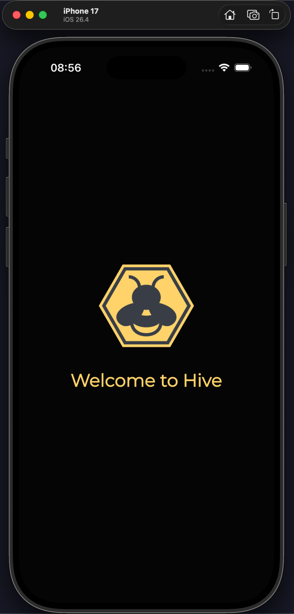
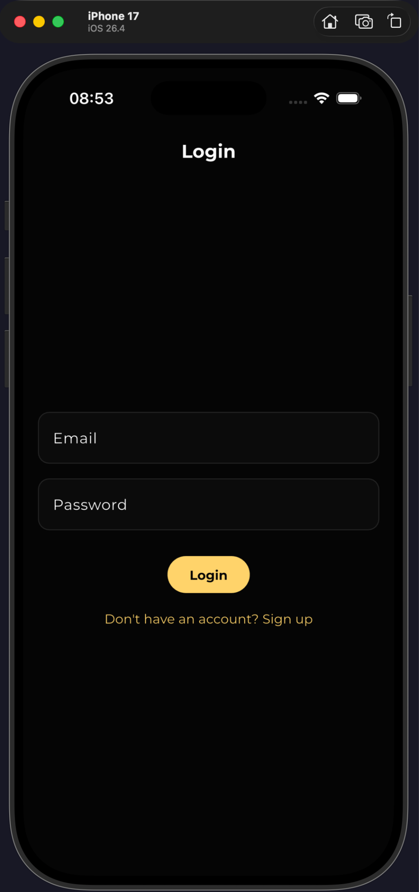
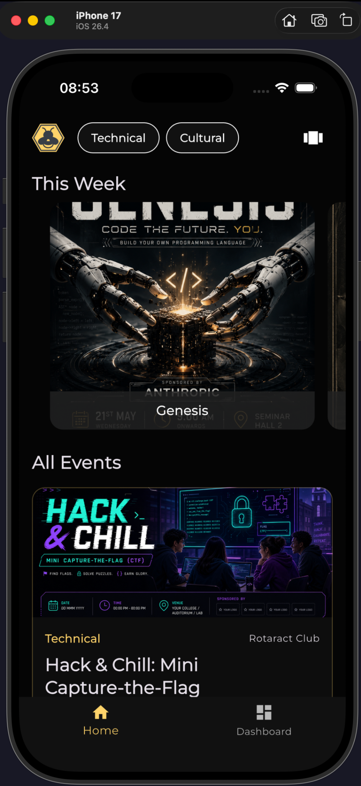
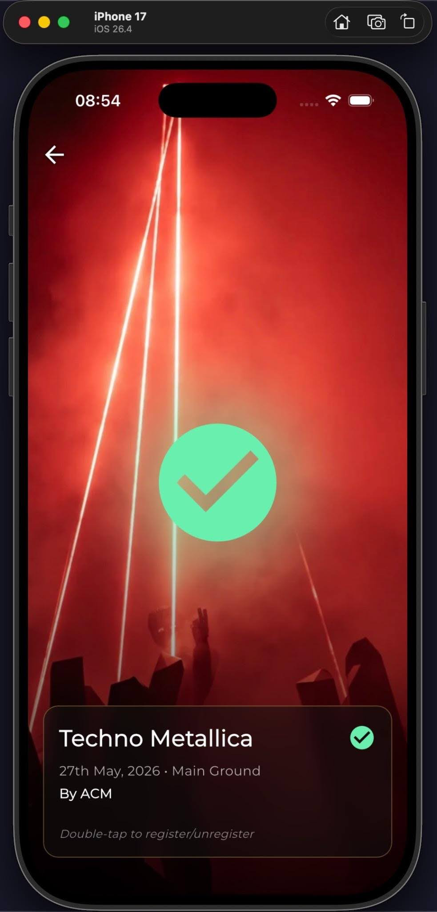
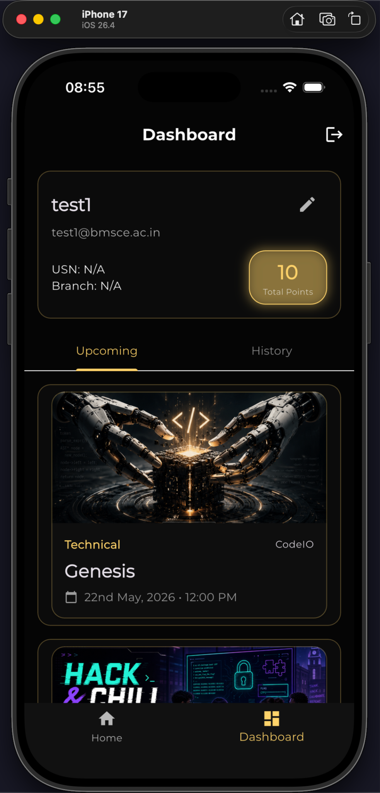
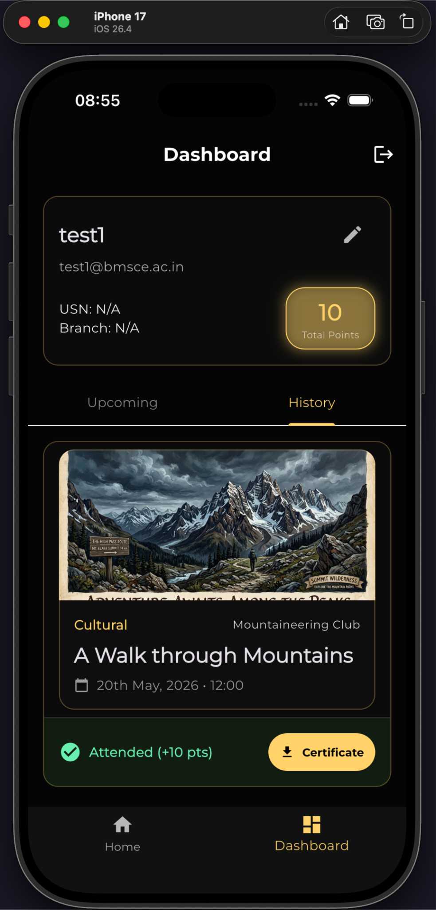
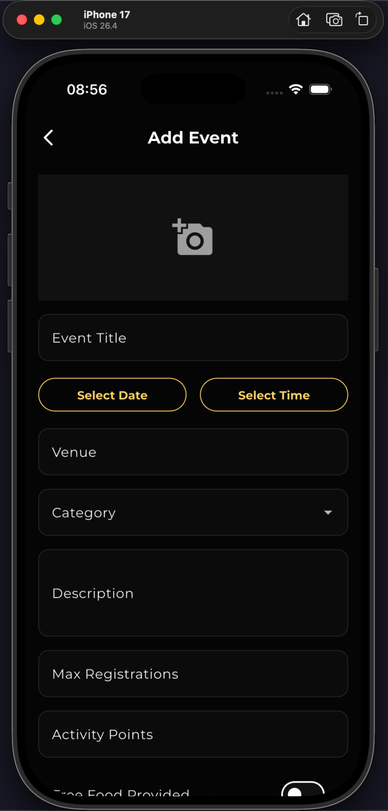
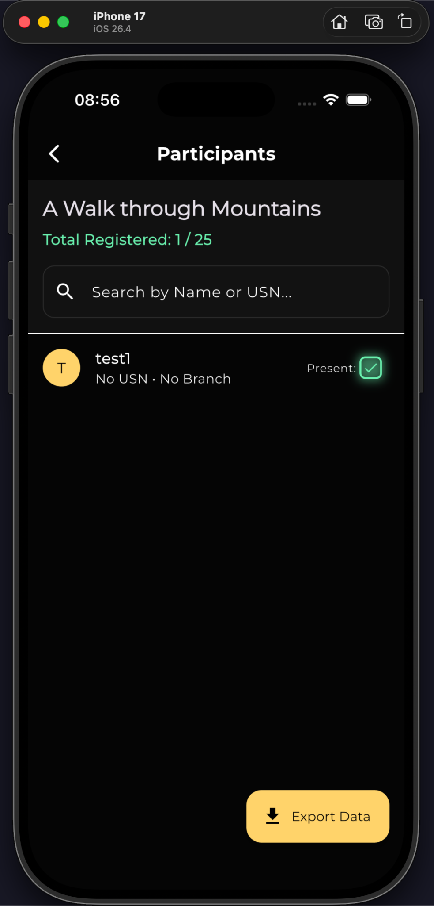

# Hive - College Events Management System

Hive is a modern, cross-platform application built to streamline campus event organization, attendee tracking, and real-time notifications. Designed with a sleek aesthetic and powered by a highly modular state-management architecture, Hive bridges the gap between event organizers and college students.

## Live Demo

This application can be viewed online at:

**Website:** https://hive-f9d01.web.app/

Visit the link above to explore the application without installing it locally.

## Screenshots

### Authentication

|                 Splash Screen                  |                 Login Screen                  |
| :--------------------------------------------: | :-------------------------------------------: |
|  |  |

### Home & Event Discovery

|                  Home Feed                   |                  Scroll Mode                   |
| :------------------------------------------: | :--------------------------------------------: |
|  |  |

### Event Details

|               Event Information                |              Registration Status               |
| :--------------------------------------------: | :--------------------------------------------: |
c
### Dashboard

|                      Upcoming Events                       |                       Event History                       |
| :--------------------------------------------------------: | :-------------------------------------------------------: |
|  |  |

### Event Management

|                   Create Event                    |               Participants Management                |
| :-----------------------------------------------: | :--------------------------------------------------: |
|  |  |

## Features

- **Multi-Channel Login:** Implements email/password authentication patterns via Firebase Auth.
- **Onboarding Flows:** Dedicated registration and verification screens.
- **Dynamic Planning:** Organizers can spin up new events natively with interactive inputs.
- **In-Place Modifiers:** Fine-tune event descriptions, venues, or timings seamlessly.
- **Deep Inspect Views:** Contextual screens highlighting event metrics, schedules, and structural descriptions.
- **Participant Manifests:** Live lookups for organizers to monitor exactly who has registered for an event.
- **Personal Schedules:** Users can aggregate and bookmark lists of events they intend to join.
- **Cloudinary Integration:** Offloads dynamic media handling and image uploads to Cloudinary, managing remote multi-target image distributions via robust service endpoints.
- **Broadcast Subscriptions:** Dispatches reactive updates regarding modifications, alerts, or global broadcast shifts.
- **Glassmorphic Components:** Implements unique visual depth layers through advanced composition wrappers.
- **Optimized Rendering Layouts:** Uses clean structural elements designed for low-friction viewport traversal.

## Installation & Setup

### Prerequisites

- Flutter SDK (Stable Channel)
- Python 3.x (to process localization files)
- Android Studio or Xcode (for simulator runtime orchestration)

### Local Configuration Steps

1. Clone the project repository:

```bash
git clone https://github.com/rohpod/hive.git
cd hive
```

2. Acquire component dependencies:

```bash
flutter pub get
```

3. Verify targets and execute target pipelines:

```bash
flutter devices
flutter run
```

## Tech Stack

- **Frontend Framework:** Flutter & Dart (Supporting iOS, Android, Web, macOS, Windows, Linux)
- **Backend Cloud Services:** Firebase Stack
  - Firebase Authentication
  - Cloud Firestore Database
  - Firebase Cloud Messaging (Push notifications)
- **Media Uploads:** Cloudinary
- **Automation Engineering:** Python 3.x Scripting

## Repository File Structure

```
├── android/                    # Android native system wrappers & configurations
├── assets/
│   └── images/
│       └── logo.png            # Main branding asset package
├── ios/                        # iOS native structural components & deployment profiles
├── lib/                        # Core Dart workspace
│   ├── models/                 # Pure structured data abstractions
│   │   ├── event_model.dart
│   │   ├── notification_model.dart
│   │   ├── saved_event_model.dart
│   │   └── user_model.dart
│   ├── providers/              # ChangeNotifier state execution engines
│   │   ├── auth_provider.dart
│   │   ├── events_provider.dart
│   │   ├── notifications_provider.dart
│   │   ├── saved_events_provider.dart
│   │   └── storage_provider.dart
│   ├── screens/                # High-level viewport definitions
│   │   ├── add_event_screen.dart
│   │   ├── dashboard_screen.dart
│   │   ├── edit_event_screen.dart
│   │   ├── event_detail_screen.dart
│   │   ├── home_screen.dart
│   │   ├── login_screen.dart
│   │   ├── main_wrapper.dart
│   │   ├── scroll_mode_screen.dart
│   │   ├── signup_screen.dart
│   │   ├── splash_screen.dart
│   │   └── view_participants_screen.dart
│   ├── services/               # Direct structural data integrations
│   │   ├── auth_service.dart
│   │   ├── database_service.dart
│   │   └── storage_service.dart
│   ├── utils/                  # App configuration & runtime mappings
│   │   ├── date_formatter.dart
│   │   ├── routes.dart
│   │   └── theme.dart
│   ├── widgets/                # Granular visual structural elements
│   │   ├── event_card.dart
│   │   └── glass_container.dart
│   ├── firebase_options.dart   # Auto-generated environmental routing target
│   └── main.dart               # Primary thread execution engine
├── linux/                      # Linux native build configuration manifests
├── macos/                      # macOS native platform orchestration frameworks
├── web/                        # Web target pipeline distributions
├── windows/                    # Windows platform specific compilation trees
├── firebase.json               # Deployment routing mappings
└── pubspec.yaml                # Manifest schema tracking and version configurations
```

## License

This project is licensed under the MIT License

Development of this application was supported by Antigravity.
